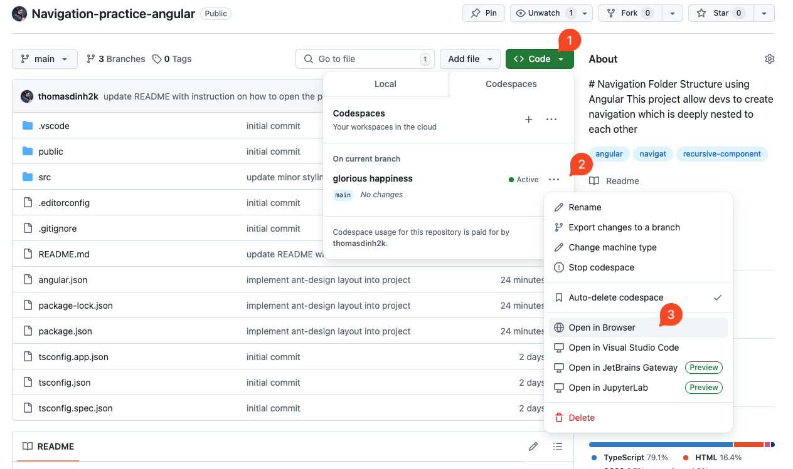

# Navigation Folder Structure using Angular

This project allows developers to create a deeply nested navigation structure.

## Components

This is only a simple project which has two components

- Main-layout: A component for creating layout using AntDesign
- Menu: This Component uses a navigation array injected by `MenuService`, and recursively extracts the it into navigation columns

```typescript
<ul nz-menu [nzMode]="'vertical'" *ngFor="let folder of navFolders">

    <app-folder [folder]="folder"></app-folder>

</ul>
```

- folder: A component that contains content for subfolders, as well as it own "folder" component trigger, which is crucial for the entire navigation to work

## Navigation file

If you wish to change the navigation, please go to `src/app/pages/main-layout/menu/menu.service.ts`

```typescript
export class MenuService {
  MenuFolder: Folder[] = []; // Modify here

  getAllNavsFolder(): Folder[] {
    return this.MenuFolder;
  }

  constructor() {}
}
```

The hierarchy of folder can be looked like

```
Root Folder/
|
|-- Folder 1/
|   |-- SubFolder 1/
|   |   |-- SubFolder 1.1/
|   |       |-- SubFolder 1.1.1/
|   |           |-- SubFolder 1.1.1.1/
|   |           |-- SubFolder 1.1.1.2/
|   |-- SubFolder 2/
|   |-- SubFolder 3/
|   |-- SubFolder 4/
|   |-- SubFolder 5/
|   |-- SubFolder 6/
|   |-- SubFolder 7/
|   |-- SubFolder 8/
|   |-- SubFolder 9/
|   |-- SubFolder 10/
|
|-- Folder 2/
|   |-- SubFolder 1/
|   |-- SubFolder 2/
|   |   |-- SubFolder 2.1/
|   |       |-- SubFolder 2.1.1/
|   |           |-- SubFolder 2.1.1.1/
|   |-- SubFolder 3/
|   |-- SubFolder 4/
|   |-- SubFolder 5/
|   |-- SubFolder 6/
|   |-- SubFolder 7/
|   |-- SubFolder 8/
|   |-- SubFolder 9/
|   |-- SubFolder 10/
|
|-- Folder 3/
|   |-- SubFolder 1/
|   |-- SubFolder 2/
|   |-- SubFolder 3/
|   |   |-- SubFolder 3.1/
|   |       |-- SubFolder 3.1.1/
|   |           |-- SubFolder 3.1.1.1/
|   |-- SubFolder 4/
|   |-- SubFolder 5/
|   |-- SubFolder 6/
|   |-- SubFolder 7/
|   |-- SubFolder 8/
|   |-- SubFolder 9/
|   |-- SubFolder 10/
|
|-- Folder 4/
|   |-- SubFolder 1/
|   |-- SubFolder 2/
|   |-- SubFolder 3/
|   |-- SubFolder 4/
|   |   |-- SubFolder 4.1/
|   |       |-- SubFolder 4.1.1/
|   |           |-- SubFolder 4.1.1.1/
|   |-- SubFolder 5/
|   |-- SubFolder 6/
|   |-- SubFolder 7/
|   |-- SubFolder 8/
|   |-- SubFolder 9/
|   |-- SubFolder 10/
|
|-- Folder 5/
    |-- SubFolder 1/
    |-- SubFolder 2/
    |-- SubFolder 3/
    |-- SubFolder 4/
    |   |-- SubFolder 4.1/
    |       |-- SubFolder 4.1.1/
    |           |-- SubFolder 4.1.1.1/
    |-- SubFolder 5/
    |-- SubFolder 6/
    |-- SubFolder 7/
    |-- SubFolder 8/
    |-- SubFolder 9/
    |-- SubFolder 10/
```

## How do I run it?

You can run it directly on **GitHub Workspace**!


- Step 1: Extract packages inside package.json (`npm install --force`). Be aware that the dependencies are in conflict
- Step 2: Run it by command `npm run dev`
- Step 3: Forward a port to see the result
- Step 4: Go into my code and give feedbacks (optional - but I need them hehe)
